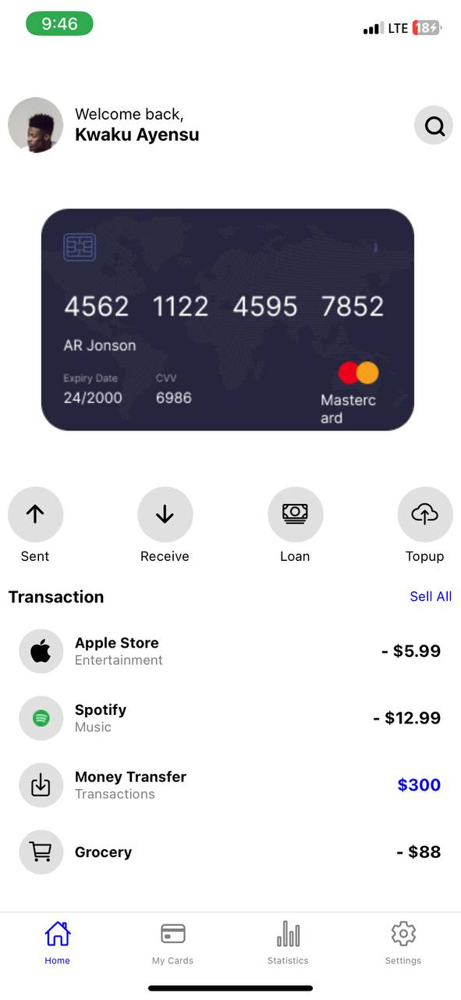
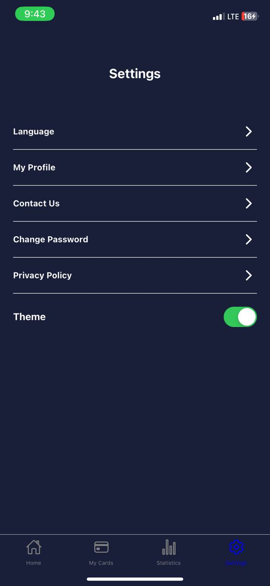

# rn-assignment5-11293982

# project title:  rn-assignment5-11293982

## description 
This project is a demonstration of advanced UI implementation in a React Native application. It includes:

- **Theme Switching**: Users can toggle between light and dark themes.
- **Custom Components**: Every UI element was crafted to align with the provided mockups.
- **Responsive Design**: Ensures that the app looks great on a variety of devices.

## screenshot

